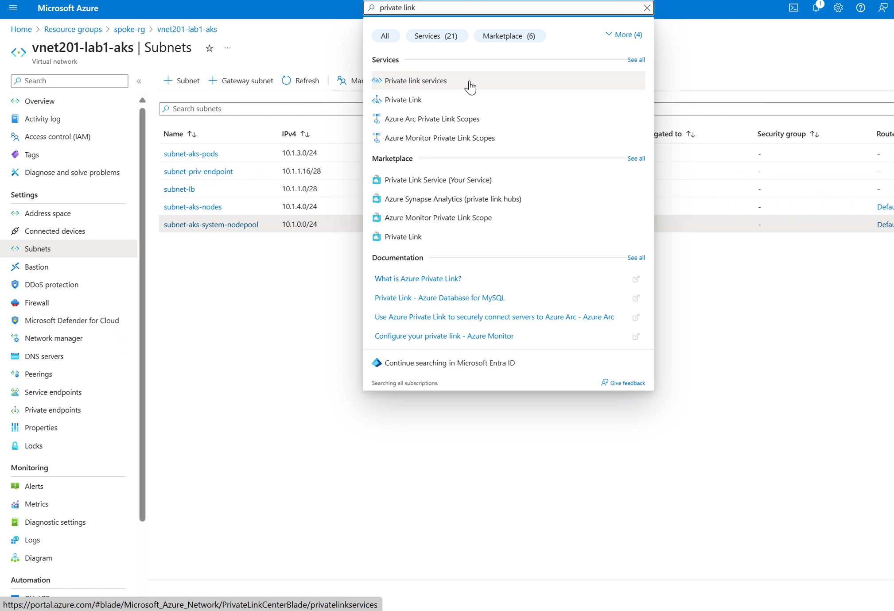
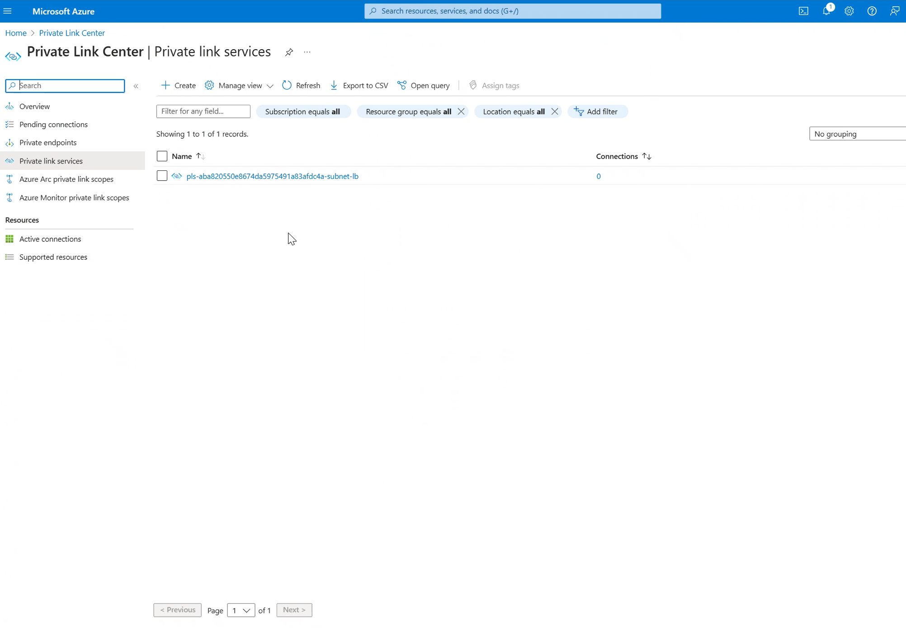
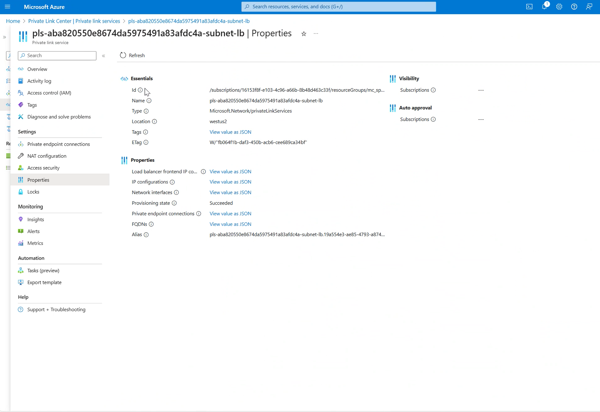

## Azure Architecture Blueprint

### Introduction

This repository provides a comprehensive software-defined infrastructure for deploying Kubernetes on Azure using Azure Kubernetes Service (AKS) and other related services. The entire infrastructure is defined and managed using Terraform.

The primary source of documentation for this repository is the comments within the ````main.tf```` Terraform template located in the ````terraform```` folder. For a more in-depth understanding, please refer to this file.

The ````main.tf```` template outlines a series of steps to deploy a full-fledged infrastructure. It is associated with the ````variables.tf```` file in the same location, which contains all the necessary variables for the deployment process.

The ````main.tf```` file utilizes various `modules` to deploy each component of the infrastructure. These modules, in turn, have their own ````variables.tf```` files. In this context, these can be viewed as placeholders and typically do not require any modifications.

The modules used are as follows:

* `Aks`: This module deploys the AKS Kubernetes Cluster.

* `Bastion_host`: This module creates the bastion host, which is used to access the jump server (that can access the Kubernetes API).

* `Container_registry`: This module creates an Azure Container Registry, which is used for storing container images.

* `Diagnostic_setting`: This module can be used to define the level of infrastructure logging (currently not in use).

* `Firewall`: This module creates the Azure firewall that handles all egress traffic.

* `Key_vault`: This module creates the Azure Key Vault for secure storage of secrets.

* `Log_analytics`: This module creates a Log Analytics workspace for comprehensive analytics and insights.

* `Network_security_group`: This module creates Network Security Groups (NSGs) for the Virtual Networks (VNETs).

* `Node_pool`: This module creates a node pool within the AKS cluster.

* `Private_dns_zone`: This module creates the private DNS zones required for the private endpoints.

* `Private_endpoint`: This module creates private endpoints (currently for Azure Container Registry and Key Vault).

* `Route_table`: This module creates a route table that directs egress traffic from AKS to the firewall.

* `Virtual_machine`: This module creates the Virtual Machine (VM) that is used by the bastion host to access the AKS Kubernetes API.

* `Virtual_network`: This module creates the hub Virtual Network (VNET).

* `Virtual_network_peering`: This module connects the VNETs together using peering.

* `Virtual_network_spoke`: This module creates the spoke VNET, which is used for isolating workloads in a hub-and-spoke architecture.


### How to use the terraform templates in this repository

#### Run templates with default values

Using the terraform templates in this repo, can be as simple as below (in reality there is a bit more to it)

````
git clone git@github.com:pelithne/azure-architecture-blueprint.git 

cd azure-architecture-blueprint

cd terraform

terraform init

terraform plan  -out=plan.out  

terraform apply "plan.out"   

````

#### Run templates with edited variables

Anything that needs to be customized in the templates should be done in the main ````variables.tf```` or by providing input variables on the command-line or through a pipeline. The content of ````main.tf```` and the various modules used from ````main.tf```` should not have to be changed.

As mentioned, the templates can be run with all default values. To customize you can edit  ````terraform/variables.tf````. Here are some examples of variables you might want to customize.

`hub_location` - The Azure region into which the *hub* VNET is deployed. Default is ````eastus2````

`spoke_location` - The Azure region into which the *spoke* VNET is deployed. Default is ````westus2````

`hub_resource_group_name` - The Resource group into which the *hub* VNET is deployed. Default name is ````hub-rg````

`spoke_resource_group_name` - The Resource group into which the *spoke* VNET is deployed. Default name is ````spoke-rg````

`hub_vnet_name` - The name of the hub VNET. Default is ````vnet200-lab1-mgmt````

`spoke_vnet_name` - The name of the spoke VNET. Default is ````vnet201-lab1-aks````

`hub_vnet_address_space` - The IP range of the hub VNET. Default range is ````10.0.0.0/22````

`spoke_vnet_address_space` - The IP range of the hub VNET. Default range is ````10.1.0.0/20````

`*_subnet_address_prefix` - The IP ranges of the various subnets. Make sure that it aligns with the address prefix of the VNET in which the subnet is located.

`aks_cluster_name` - The name of the AKS cluster. Default is ````aks-cluster````

`default_node_pool_vm_size` - The type of VM to use in the System node pool. Default is ````standard_d2as_v5````

`additional_node_pool_vm_size` - The type of VM to use in the User node pool. Default is ````standard_d2as_v5````

`default_node_pool_node_count` - The number of VMs to use in the system node pool. Default is a minimalistic ````1````

`additional_node_pool_node_count` - The number of VMs to use in the user node pool. Default is a minimalistic ````1````

#### Create a private link from AKS

Azure Kubernetes Service (AKS) with Private Link Service (PLS) integration allows users to privately connect to a Private Endpoint (PE) in a VNET in Azure and a Frontend IP Configuration associated with an Azure Load Balancer (ALB). This integration simplifies the process of creating private links to the AKS Load Balancer, enhancing security by enabling private connectivity without data exfiltration risks. This section concentrates on creating the private link.

1) Navigate to the Azure portal at [https://portal.azure.com](https://portal.azure.com) and enter your login credentials.
2) Once logged in, locate and select your **hub** resource group  where the jumbox is located in.
3) Within your resource group, find and click on the **Jumpbox VM**.
4) In the left-hand side menu, under the **Connect** section, select ‘Bastion’.
5) Enter the **credentials** for the Jumpbox VM and verify that you can log in successfully.
6)  Once successfully logged in to the jumpbox **install azure cli and kubectl tool** 
   ````bash
   # Install Azure CLI
   curl -sL https://aka.ms/InstallAzureCLIDeb | sudo bash
   # Install aks cli (kubectl)
   sudo az aks install-cli
   # az login
   # get credential
   az aks get-credentials -n <AKS CLUSTER NAME> -g <SPOKE RESOURCE GROUP NAME> --admin
   ````
7) Create private link.

On the Jumpbox VM create a yaml file.

````bash
touch test-pls-service.yaml
vim test-pls-service.yaml
````
when you copy to vim, prevent Vim from auto-indenting the text you paste.

````bash
:set paste
````
Press enter.

Paste in the following manifest file which creates a service object named **internal-app**


````bash  
apiVersion: v1
kind: Service
metadata:
  name: internal-app
  annotations:
    service.beta.kubernetes.io/azure-load-balancer-internal: "true"
	service.beta.kubernetes.io/azure-load-balancer-internal-subnet: "<LOAD BALANCER SUBNET NAME>"
	service.beta.kubernetes.io/azure-pls-create: "true"
spec:
  type: LoadBalancer
  ports:
  - port: 80
  selector:
    app: internal-app
````

8) Create the service object.

````yaml
kubectl create -f test-pls-service.yaml
````
9) Verify that the service object has an external IP.

Initially the state will be in pending for 1 - 3 minutes.
````bash
azureuser@Jumpbox-VM:~$ kubectl get svc
NAME           TYPE           CLUSTER-IP   EXTERNAL-IP   PORT(S)        AGE
internal-app   LoadBalancer   10.2.0.118   <pending>     80:30457/TCP   7s
kubernetes     ClusterIP      10.2.0.1     <none>        443/TCP        30m
````
After 1-3 min you should see a private IP (External IP) address generated, as depicted below.
````bash
azureuser@Jumpbox-VM:~$ kubectl get svc
NAME           TYPE           CLUSTER-IP   EXTERNAL-IP   PORT(S)        AGE
internal-app   LoadBalancer   10.2.0.118   10.1.1.4      80:30457/TCP   2m46s
kubernetes     ClusterIP      10.2.0.1     <none>        443/TCP        33m
````

10) Verify that the private link is created, in the search field type in Private link and select **Private Link Services** from the drop down menu.



11) Validate that your private link connection doesnt have any connection established.
    


12)  Obtain the resource id of the private link, as this is what the consumer will need to have, in order to consume the service. on your right hand side menu click on **Properties** and copy the **id**.




### Disclaimer
The Terraform code provided in this repository is intended for use as a reference only. It is provided ‘as is’ without warranty of any kind, either expressed or implied. We make no guarantees regarding its accuracy, reliability, or completeness. The user is responsible for reviewing, testing, and ensuring the code meets their own security and performance requirements. We accept no liability for any damage or loss resulting from the use of this code.